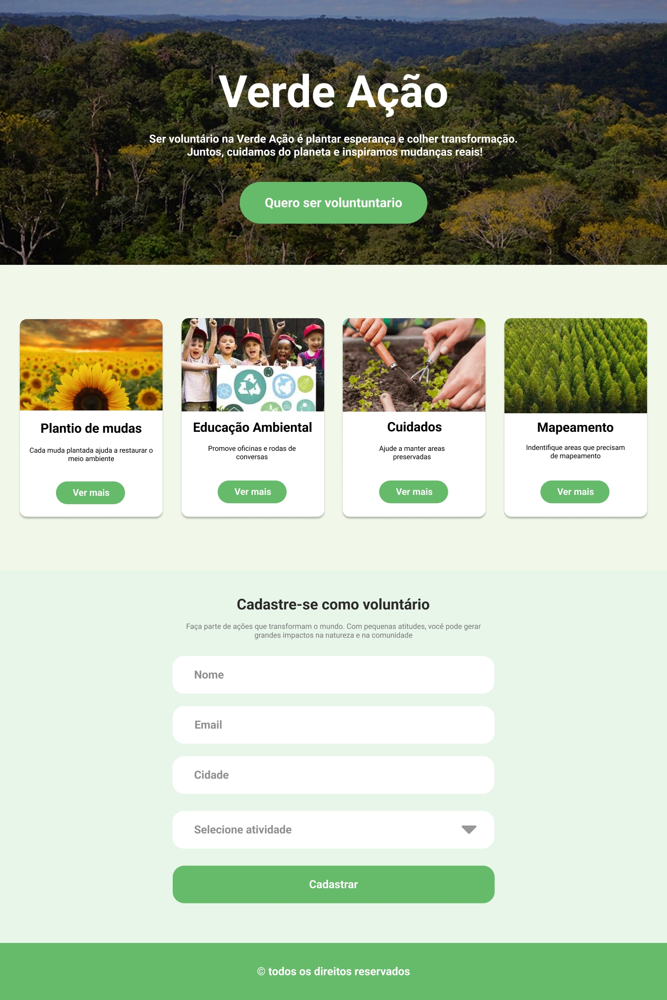

# Desafio Acao Verde

Esse é um desafio de reprodução de uma landing page desenvolvida pela Vai na Web para que podessemos praticar a base do CSS usando SCSS e HTML.

## Captura de tela

## Tecnologias usadas
- HTML
- SCSS
  - Box Model
  - Cor
  - Tipografia
  - Medidas
  - Background

> Atenção! 
> Futuramente, esse desafio será atualizado de acordo com o decorrer do curso. Por isso, que não foi utilizado tecnologias como flex e grid em alguns pontos, com excessão do container dos cards.